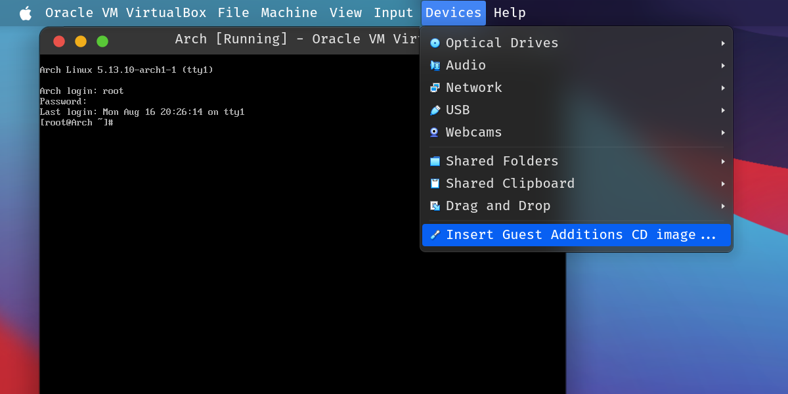
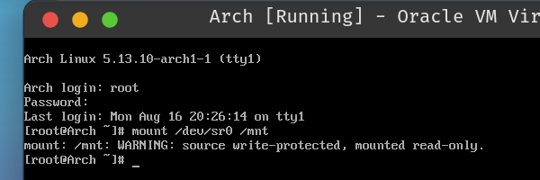
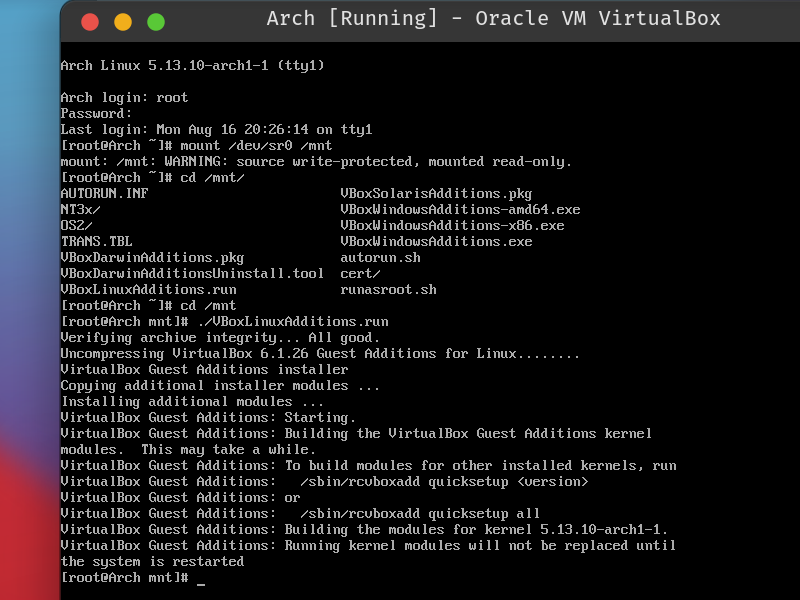

### 光盘映像来源
- [官方网站](https://archlinux.org/download "点击跳转此站外链接")
- [各大开源软件镜像站](../mirrorlist "点击查看: 国内常见镜像站合集")

### 用于此实例虚拟机的额外配置
- 操作系统版本 Linux (可选)
- 处理器 2 个 (必需)
- 内存 4096 MB (必需)
- 启用 PAE (可选)
- 视频控制器 VMSVGA (必需)
- 视频内存 128 MB (可选)
- 启用 3D 加速 (可选)
- 储存控制器 SATA (必需)
- 启用主机读写缓存 (可选)
- 固态驱动器 (可选)
<iframe src="../resources/VM/InstallArch.mp4"
        allowfullscreen="true"
        border="0"
        frameborder="no"
        framespacing="0"
        scrolling="no"></iframe>

### 在未安装桌面环境时安装增强功能:
1. 推荐
   1. 点击虚拟机菜单中的 [安装增强功能](# "Insert Guest Additions CD Image...")
   
   2. 在虚拟机中 [挂载](# "mount /dev/sr0 /mnt") 上一步插入的光盘映像到随意一个空目录下, **请忽略警告**.
   
   3. 切换到挂载点, 开始 [build](# "./VBoxLinuxAdditions.run"). 如出现依赖问题, 请安装它提示的包. 一般 ArchLinux 安装 [base-devel](https://archlinux.org/groups/x86_64/base-devel "点击跳转") 包组即可.
   
   4. [重启](# "reboot") 完成安装.
2. 不推荐
``` shell
> pacman -Syu virtualbox-guest-utils
```
