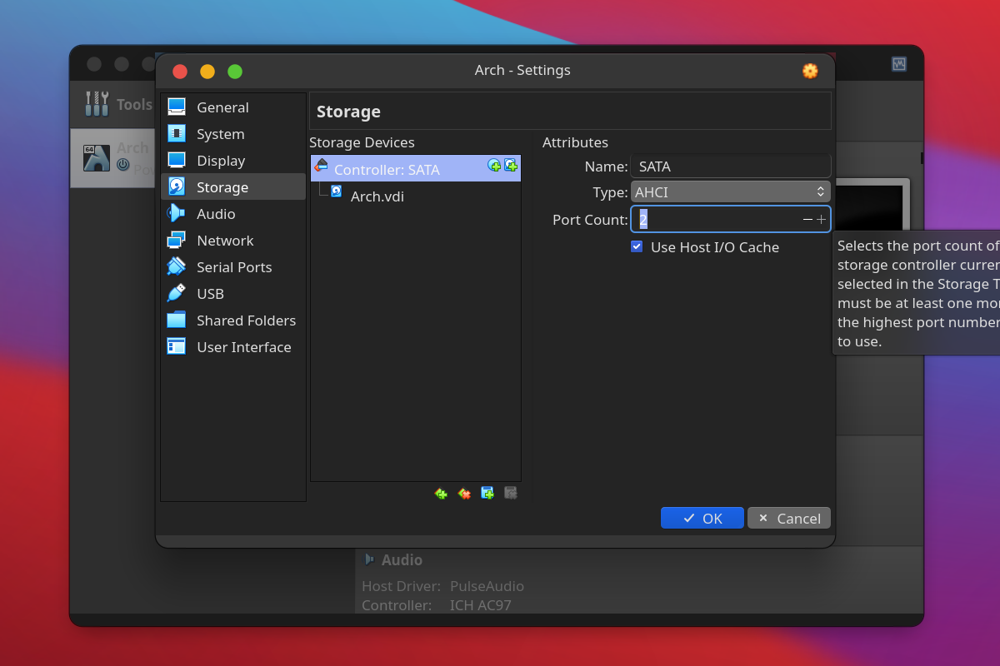

### VirtualBox 是何方神圣
下面来看官方是怎么介绍的 [(有改动)](# "本人英语水平有限, 如有不当, 请联系我更改"):

VirtualBox 是一个同时适用于家庭和企业生产的强有力的 x86 平台虚拟化产品. 功能丰富, 性能优越的 VirtualBox 不仅适仅对于企业用户, 它也是唯一一个可以作为自由软件的专业级解决方案, 开源版本主要使用 [GPL v2 许可证](# "拓展包使用不同的许可证").

目前, VirtualBox可以在 Windows, Linux, [Macintosh](# "即 macOS, 特定条件下可以运行 Hackintosh"), [Solaris](# "原 SunOS, 由太阳微系统公司(Sun Microsystems)开发, 后者被甲骨文公司(Oracle)收购") 主操作系统中运行, 并支持大量来宾操作系统包括但不限于 Windows (NT 4.0, 2000, XP, Server 2003, [Vista](# "支持此系统 Aero 效果的最高软件版本为 6.0.x"), Windows 7, Windows 8, Windows 10, [Windows 11](# "此操作系统经过本人测试可以流畅运行, 且 BUG 比 Windows 10 少")), DOS/Windows 3.x, Linux (2.4, 2.6, 3.x, 4.x 和 [5.x](# "一般通用内核以集成相应模块, 5.x 可以运行, 但是使用 VBoxSVGA 一般会出问题")), Solaris and OpenSolaris, [OS/2](# "IBM 与微软合作开发的远古操作系统"), and OpenBSD.

VirtualBox 开发进程活跃并且发布新版本频率快, 通常会添加一系列新功能, 支持更多的来宾操作系统和可以运行的平台. VirtualBox 是由一家专门的公司支持的社区努力的成果: [Oracle](# "即甲骨文公司, VirtualBox 原本由太阳微系统公司(Sun Microsystems)开发, 后随 Sun 一起并入") 在确保产品总是符合专业质量标准的同时鼓励每一个人贡献自己的代码.
### 开始使用 VirtualBox
#### 入门教程
##### 1. [准备必要文件](# "Linux 用户可跳过此步, 并且我默认 Linux 用户可以自己解决问题")
1. VirtualBox 安装程序
点击进入 [官网的下载页面](https://www.virtualbox.org/wiki/downloads "Oracle VM VirtualBox"), 如图:

- **<1>** 下载 VirtualBox 安装程序, 根据你自己正在用的系统选择. 如果你是 Windows 用户, 选择 [Windows 版本](# "Windows hosts"), 如果你是 [苹果](# "macOS") 用户, 选择 [mac OS X 版本](# "OS X hosts").
- **<2>** 下载 [功能拓展包](# "All platforms"), 只有一个, 是 [全平台](# "Linux, macOS, Windows") 通用的.
- **<3>** 可选查看所有文件的校验和, 并 [校验](../checksums "点击查看: 文件校验") 下载的文件, 推荐使用 [SHA256 算法](# "一种哈希算法, 常用于比对文件之间是否有差异").
- **<4>** 这些是旧版本的 VirtualBox 下载链接. 如果你需要使用 [新版本](# "VirtualBox 6.1") [弃用的功能](# "包括但不限于 VBoxVGA 的 3D 加速功能, 在 32 位系统上运行 VirtualBox 的支持"), 可以考虑下载旧版本的 VirtualBox. **Linux 用户**请注意, 如果你使用较新的 Linux 内核, 旧版本的 VirtualBox 可能**完全无法正常使用**.
2. 准备光盘映像
- 点击此处查看 [国内常见镜像站合集](../mirrorlist "国内常见镜像站合集")

- 一般我们使用的镜像格式后缀为 .iso, 另外强烈建议这类大型文件下载完一定要**校验**!! (如何校验可参考 [这里](../checksums "文件校验"))

##### 2. 安装 VirtualBox
- Windows 用户**以管理员身份运行**下载的 [可执行文件](# ".exe").
- [苹果](# "macOS") 用户双击下载的 [光盘映像](# ".dmg"), 然后自动安装.

##### 3. VirtualBox 用户界面
1. 应用程序主窗口

2. 这是菜单,位置可能不一样

##### 4. 安装功能拓展包
1. 打开全局设置

2. 选择你的拓展包所在位置,点击安装

##### 5. 创建虚拟机

   以 ArchLinux 为例, 这里带你用最快速度进行一些基本配置:

   1. 点击 'Add' 按钮开始一个新建向导, 点击 [专家模式](, "其实都差不多的"), 给虚拟机取个名字, 分配 [合适的内存大小](# "实测 4096 MB 最合适, 并不是越多越好, 多了不仅浪费而且性能有所下降"), 然后下一步.
    
   2. 创建虚拟磁盘, 分配储存空间大小, 默认是动态分配, 所以 [尽量多分一些](# "Windows 虚拟机例外, 可以随意分配, 后期拓展卷比较方便").
   [格式](../virtualdisk "点击查看虚拟磁盘") 使用默认, 性能是最好的, 下一步.
    

##### 6. 进行基本配置

   1. 调整处理器数量, 分配一个 [完整的核心](# "一般是一个, 超线程是两个") 即可, 打开 [PAE](../pae "点击查看: 物理寻址拓展").
   如果你的是较新的 [锐龙](# "AMD Ryzen") 处理器, 下面的 [嵌套虚拟化](.) 应该是可以点亮的, 不过注意, 这是一项实验性功能, 如果此选项被禁用, 头铁的兄弟可以使用 [此命令](# "VBoxManage modifyvm <虚拟机名字> --nested-hw-virt on") [强制打开](# "本人试过没有意外发生").
    
   2. 接下来是显示相关的配置, 可以开启 [3D 加速](# "需要安装增强功能"), 显存尽可能拉大.
   VirtualBox 支持的最大视频内存为 256 MB, 由于 [VBoxVGA 和 VMSVGA](../gpu "两种虚拟图形控制器, VBoxVGA 从 6.1 开始被弃用, 取而代之的是 VBoxSVGA 和 VMSVGA. 点击查看更多详情") 默认 128 MB 上限, 头铁的兄弟可以使用 [此命令](# "VBoxManage modifyvm <虚拟机名字> --vram 256") [将视频内存拉到最大](# "本人测试过一切正常").
    
   3. 储存控制器一般选择 [SATA](# "一种储存控制器, SATA 2.0 满速为 3.0 Gb/s, SATA 3.0 满速为 6.0 Gb/s"), 也可以选 [NVMe](# "目前 Windows 原版安装镜像只有 Windows 8.1 原生自带此驱动"), 如有 [IDE](# "远古控制器之一, 本人用过真正的 IDE 光驱, 然后你懂得"), 请移除该控制器, 并增加 [SATA](# "一种储存控制器, SATA 2.0 满速为 3.0 Gb/s, SATA 3.0 满速为 6.0 Gb/s") 通道的最大连接数.
   如果 [控制器下没有光驱](# "比如我刚刚移除了 IDE 控制器, 其下的光驱位也将被移除"), 点击'Controller: SATA'上的按添加光驱, 选择你现有的光盘映像, 也可以先留空.
   如果你使用的是固态硬盘, 可以在对应虚拟磁盘下勾选 [固态驱动器](# "Solid-state Drive"), 为达到最佳效果, 请同时勾选控制器下的 [使用主机读写缓存](# "Use Host I/O Cache").
    
    
    
    
    
   4.后来的配置暂时不讲, 默认即可.

##### 7. 一切准备就绪, 那么开始吧!

   1. 调整完配置后启动:
    
   2. 开始安装系统:
<iframe src="../resources/VM/InstallArch.mp4"
        allowfullscreen="true"
        border="0"
        frameborder="no"
        framespacing="0"
        scrolling="no"></iframe>

##### 8. 安装增强功能

   - Debian 和 ArchLinux 等发行版的包管理中已有 [相关的包](# "如 ArchLinux 的 virtualbox-guest-utils").
   但是建议使用虚拟机菜单上的 [安装增强功能](# "Insert Guest Additions CD Image...") 安装, 具体原因暂不解释.
   - 以未安装桌面环境的 ArchLinux 为例:
     1. 点击虚拟机菜单中的 [安装增强功能](# "Insert Guest Additions CD Image...")
      
     2. 在虚拟机中 [挂载](# "mount /dev/sr0 /mnt") 上一步插入的光盘映像到随意一个空目录下, **请忽略警告**.
      
     3. 切换到挂载点, 开始 [build](# "./VBoxLinuxAdditions.run"). 如出现依赖问题, 请安装它提示的包. 一般 ArchLinux 安装 [base-devel](https://archlinux.org/groups/x86_64/base-devel "点击跳转") 包组即可.
      
     4. [重启](# "reboot") 完成安装.

#### 高级用户教程

- 暂时参考 [用户手册](https://www.virtualbox.org/manual "User Manual (HTML version)"), 作者忙.

### 关于实例

- 为什么选 Linux

  点击阅读 [什么是 Linux](../linux "什么是 Linux")

- 为什么选 ArchLinux

  [Arch 原则](https://wiki.archlinux.org/title/Arch_Linux "Arch Linux"): 简洁, 现代, 实用主义, 以用户为中心.
- 关于安装 Windows
      
  如果你有 Windows 安装镜像, 并且觉得 Windows 更适合你, 请跳转 [此处](../boxwindows "VirtualBox 安装 Windows").

### 参考链接

- [用户手册](https://www.virtualbox.org/manual "User Manual (HTML version)")
